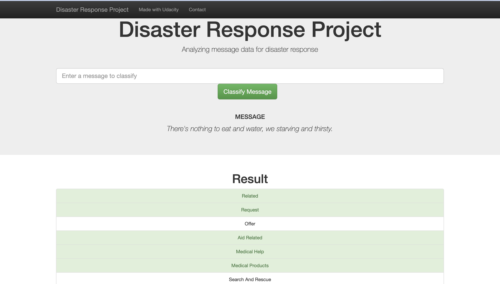
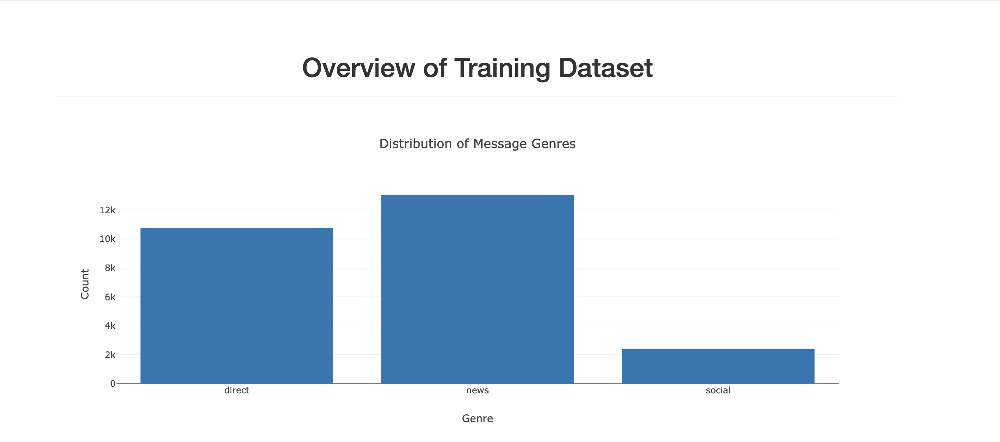

# Disaster Response Pipeline Project

### Table of Contents

1. [Project Descriptions](#descriptions)
2. [Installation](#installation)
3. [File Descriptions](#files)
4. [Instructions](#instructions)
5. [Licensing, Authors, and Acknowledgements](#licensing)

## Project Descriptions 

This project builds ETL and ML pipelines to categorise real-time disaster messages. The main goal is to help disaster response organisations to prioritise and efficiently allocate resources based on the categorisation of incoming messages during a disaster. The project includes data cleaning, model training, and a web application to classify messages. An example of such an API to classify disaster messages is shown below. 

## Installation 

Beyond the Anaconda distribution, this project requires several Python libraries to be installed. These include:
- numpy and pandas for data manipulation and analysis
- sqlalchemy for database management
- re for regular expressions and text processing
- NLTK for natural language processing tasks
- pickle for object serialisation
- Sklearn and xgboost for machine learning algorithms and - model building
- plotly for creating interactive visualisations
- flask for developing the web application

After installation, the code is compatible with Python 3 and should run without issues. 

## File Descriptions 

The repository is documented as follows:
~~~~~~~
Disaster Response Pipeline
    |-- app                                     # Flask file to run the web application
          |-- run.py
          |-- templates
                  |-- go.html
                  |-- master.html               # Main page of the web application
    |-- data
          |-- disaster_message.csv              # Dataset containing the messages
          |-- disaster_categories.csv           # Dataset containing the categories correponding to messages
          |-- DisasterResponse.db               # SQLite database to store cleaned data
          |-- process_data.py                   # Script to clean and store data in the database
    |-- models
          |-- MLclassifier.pkl                  # Trained ML model
          |-- train_classifier.py               # Script to train the model
    |-- prep
          |-- categories.csv                    # Sample category data
          |-- messages.csv                      # Sample message data
          |-- ETL Pipeline Preparation.ipynb    # Notebook for ETL pipeline preparation
          |-- ML Pipeline Preparation.ipynb     # Notebook for ML pipeline preparation
          |-- disaster_messages.db
          |-- MLclassifier.pkl
    |-- README
    |-- WebApp_vis.png                          # Screenshot of the web application
~~~~~~~

## Instructions 

1. Run the following commands in the project's root directory to set up your database and model.

    - To run ETL pipeline that cleans data and stores in database
        `python data/process_data.py data/disaster_messages.csv data/disaster_categories.csv data/DisasterResponse.db`
    - To run ML pipeline that trains classifier and saves
        `python models/train_classifier.py data/DisasterResponse.db models/MLclassifier.pkl`

2. Run the following command in the app's directory to run your web app.
    `python run.py`

3. Go to http://0.0.0.0:3001/

## Licensing, Authors, Acknowledgements

Hongyi Lu is the author of this analysis. The disaster datasets were obtained from [Udacity](https://www.udacity.com/), provided by [Appen](https://www.figure-eight.com/). This study is completed as part of Hongyi's projects in the Udacity Data Science Nanodegree. Apart from these, feel free to use the code here as you wish! 